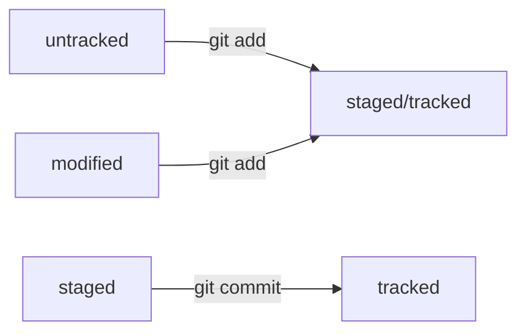

# Статусы файлов
Файлы в _Git_ могут иметь 4 разных статуса.
1. Untracked - Git видит файл, но ещё не отслеживает его версию и изменения в нем.
2. Staged - Git отслеживает файл. Stage - буквально "файл на сцене", подготовлен к коммиту. Любой Staged файл также Tracked.
3. Modified - файл был изменен, поэтому если файл отслеживался ранее, то Git сохранил только его прошлую версию, без изменений.
4. Tracked - все отслеживыаемые файлы из staging area или закомиченные файлы.
При выводе `git status` git явно показывает только 3 статуса. Статус Tracked Git не выводит.

